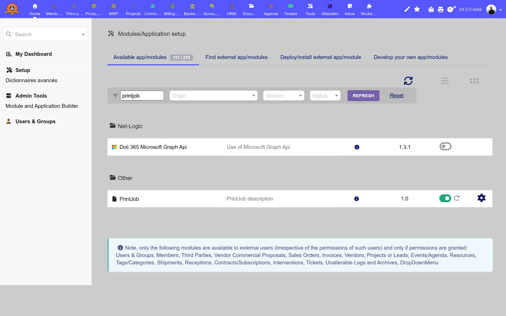
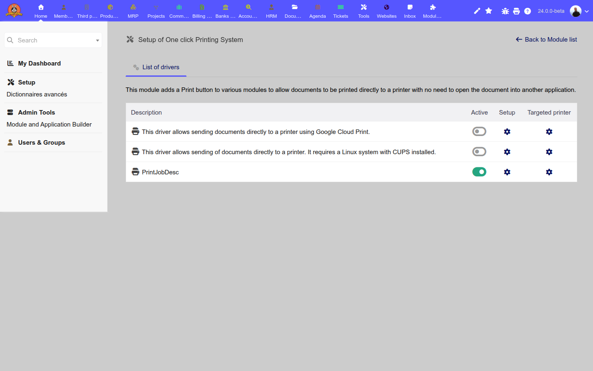
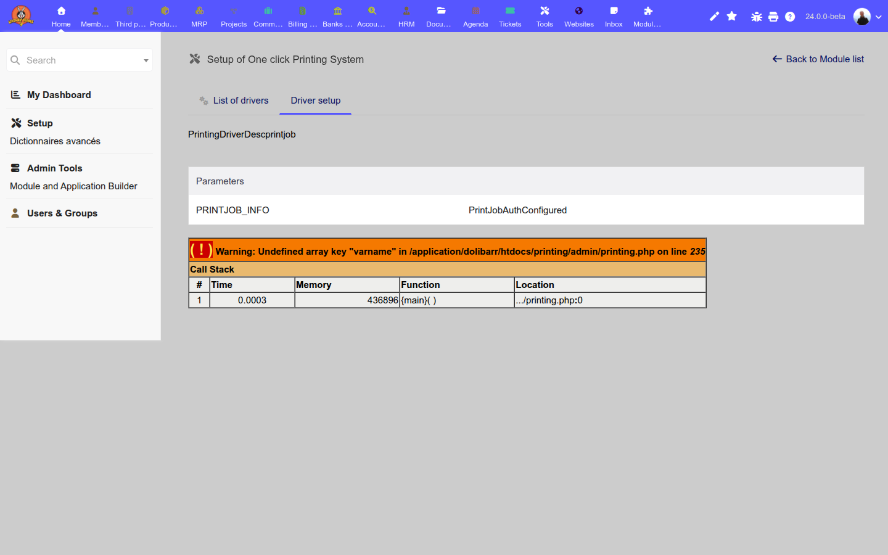
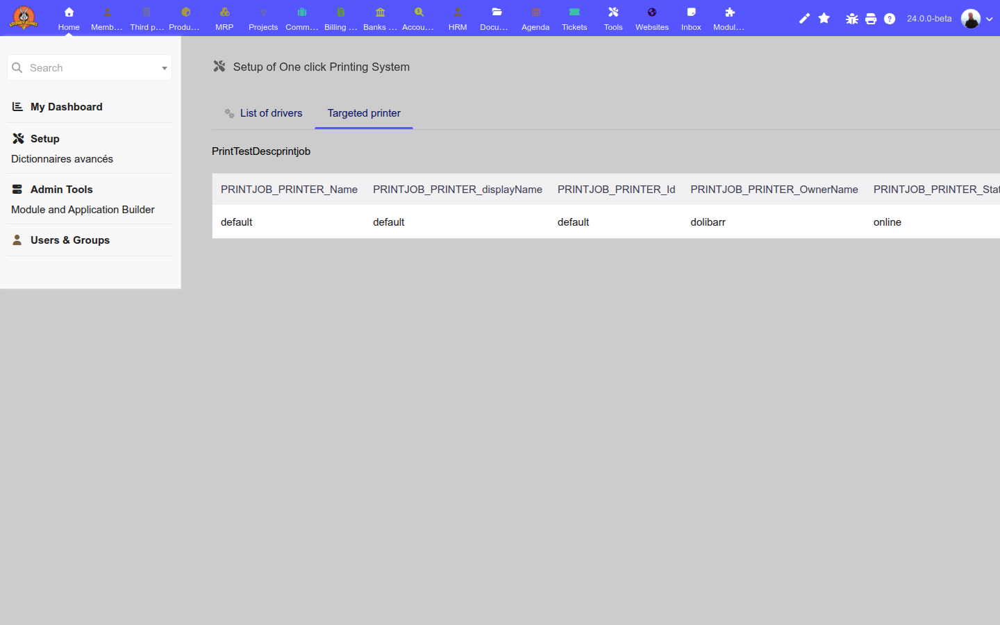
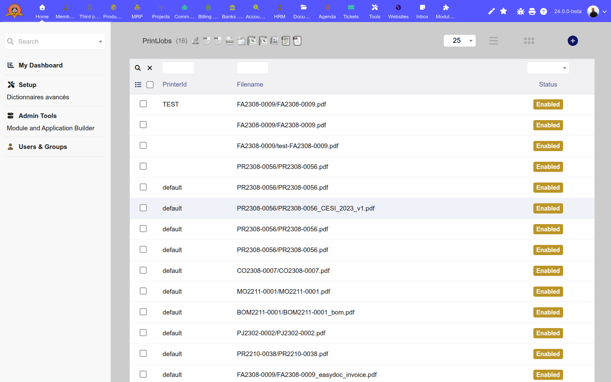
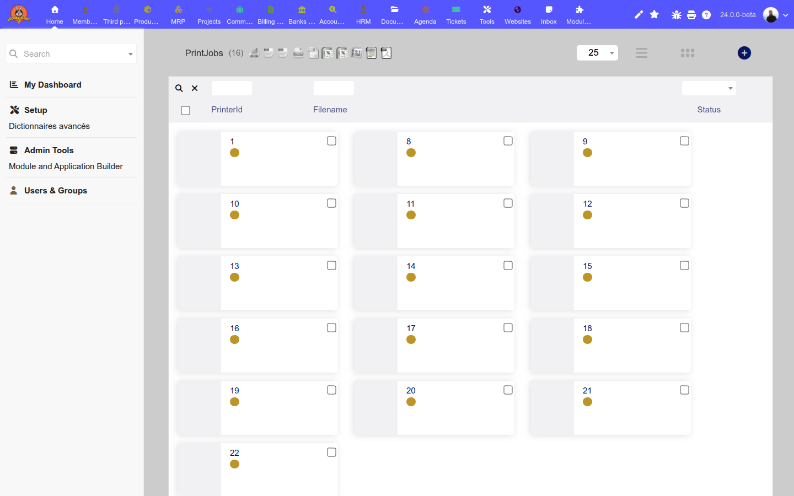
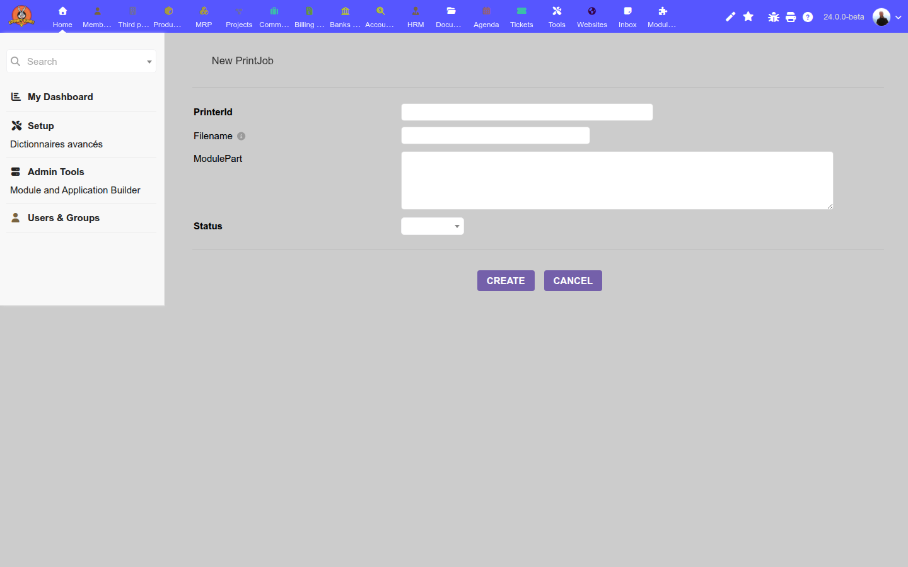
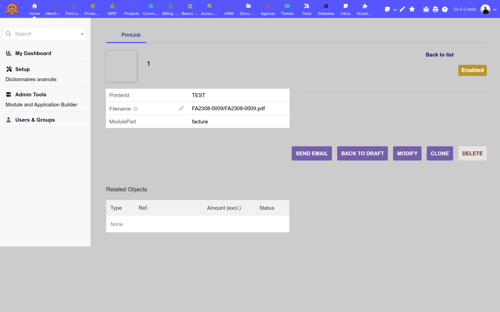
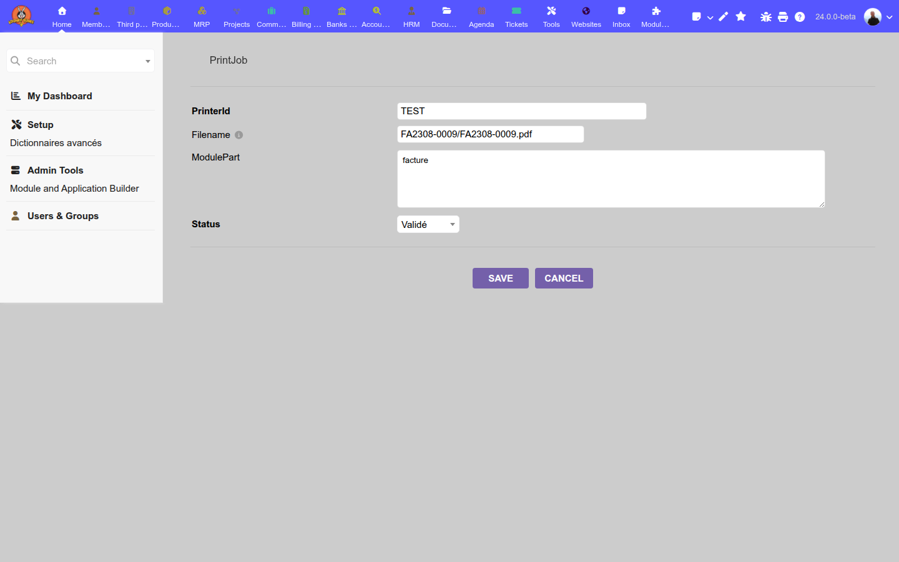

# Module PrintJob — Documentation

**Auteur :** Frédéric France — Net Logic  
**Version :** 1.0  
**Dolibarr :** 19.x et supérieur  
**PHP minimum :** 7.4  
**Licence :** GPLv3

---

## Présentation

Le module **PrintJob** ajoute à Dolibarr un driver d'impression qui enregistre chaque demande d'impression en base de données sous forme d'une file d'attente (*print queue*). Au lieu d'envoyer directement un fichier à une imprimante physique, il crée un enregistrement `PrintJob` dans la table `llx_printjob`. Un service distant (ou script cron) peut ensuite récupérer la file via l'API REST et déclencher l'impression.

**Cas d'usage typique :** impression sans pilote local, impression déportée sur un serveur d'impression distant, traçabilité des documents imprimés.

---

## Prérequis

Avant d'activer le module PrintJob, les modules suivants doivent être actifs :

| Module | Rôle |
|--------|------|
| **API** (`modApi`) | Expose les endpoints REST |
| **Impression** (`modPrinting`) | Fournit le système de drivers d'impression |

---

## Installation et activation

### 1. Déposer le module

Copier le dossier `printjob/` dans `htdocs/custom/`.

### 2. Activer dans l'interface

Aller dans **Modules/Application setup** → rechercher « printjob » → activer le toggle.



Le module apparaît dans la catégorie **Other**, version 1.0. L'activation crée automatiquement la table `llx_printjob` et le répertoire `documents/printjob/`.

---

## Configuration du driver d'impression

### Accès

**Administration → Impression → Setup of One click Printing System**



La liste affiche tous les drivers disponibles. Le driver **PrintJobDesc** (PrintJob) doit être activé (toggle vert).

### Paramètres du driver

Cliquer sur l'icône engrenage **Driver setup** pour accéder aux paramètres :



La page affiche le paramètre `PRINTJOB_INFO` indiquant l'état de la connexion (`PrintJobAuthConfigured`).

> **Note :** La configuration OAuth/authentification vers un serveur d'impression distant est en cours de développement. Dans la version actuelle, tous les jobs sont enregistrés en base localement.

### Imprimantes disponibles

L'onglet **Targeted printer** liste les imprimantes déclarées par le driver :



Dans la version actuelle, une seule imprimante fictive `default` est retournée (placeholder). Elle sert de cible par défaut pour tous les jobs.

---

## Utilisation

### Liste des jobs d'impression

Accès : **Menu → PrintJobs** (ou URL `/custom/printjob/printjob_list.php`)



La liste affiche pour chaque job :

| Colonne | Description |
|---------|-------------|
| **PrinterId** | Identifiant de l'imprimante cible |
| **Filename** | Chemin relatif du fichier PDF à imprimer |
| **Status** | État du job (Brouillon / Enabled / Annulé) |

La liste supporte le tri par colonne, la pagination, et la recherche par filtre.

#### Vue Kanban

Basculer en mode kanban avec l'icône grille en haut à droite :



---

### Créer un job manuellement

Cliquer sur **+** dans la liste ou accéder à `/custom/printjob/printjob_card.php?action=create` :



| Champ | Obligatoire | Description |
|-------|-------------|-------------|
| **PrinterId** | Oui | Identifiant de l'imprimante (ex : `default`, UUID cloud) |
| **Filename** | Non | Nom/chemin du fichier à imprimer |
| **ModulePart** | Non | Module source du document (`facture`, `commande`, `propal`…) |
| **Status** | Oui | État initial (généralement `Brouillon`) |

> En pratique, les jobs sont créés automatiquement par le driver lorsque l'utilisateur clique sur le bouton **Imprimer** dans un module Dolibarr (factures, commandes, etc.).

---

### Fiche détail d'un job



La fiche affiche :
- Le **PrinterId**, **Filename** et **ModulePart**
- Le **statut** courant (badge coloré)
- Les objets liés (*Related Objects*)
- Les boutons d'action : **Send Email**, **Back to Draft**, **Modify**, **Clone**, **Delete**

---

### Modifier un job

Cliquer sur **Modify** depuis la fiche :



Tous les champs sont modifiables. Le statut peut être changé manuellement via le sélecteur.

---

## Cycle de vie d'un job

```
[Document Dolibarr]
       |
       | Clic "Imprimer"
       ▼
[PrintingDriver::printFile()]
       |
       | sendPrintToPrinter()
       ▼
[llx_printjob] ← INSERT status=0 (Brouillon)
       |
       | Service distant / API REST
       ▼
[PUT /api/printjobs/{id}] ← status=1 (Imprimé)
```

---

## API REST

Le module expose 3 endpoints via l'API Dolibarr (module API requis) :

### GET `/api/printjob/printjob/{id}`
Retourne les détails d'un job par son ID.

**Permission requise :** `printing > read`

### GET `/api/printjobs/`
Liste tous les jobs avec pagination et filtres SQL.

| Paramètre | Type | Description |
|-----------|------|-------------|
| `sortfield` | string | Champ de tri (défaut : `t.rowid`) |
| `sortorder` | string | Ordre (`ASC` / `DESC`) |
| `limit` | int | Nombre de résultats (défaut : 100) |
| `page` | int | Page |
| `sqlfilters` | string | Filtre universel SQL |

**Permission requise :** `printing > read`

### PUT `/api/printjobs/{id}`
Met à jour le statut d'un job (ex : marquer comme imprimé).

| Paramètre | Type | Description |
|-----------|------|-------------|
| `status` | int | Nouveau statut (0=Brouillon, 1=Imprimé, 9=Annulé) |

**Permission requise :** `printing > read`

### DELETE `/api/printjobs/{id}`
Supprime un job.

**Permission requise :** `printjob > printjob > delete`

---

## Statuts

| Valeur | Constante | Label | Couleur |
|--------|-----------|-------|---------|
| `0` | `STATUS_DRAFT` | Brouillon | Gris |
| `1` | `STATUS_PRINTED` | Enabled (Imprimé) | Doré |
| `9` | `STATUS_CANCELED` | Annulé | Rouge |

---

## Structure de la table `llx_printjob`

```sql
CREATE TABLE llx_printjob (
    rowid         INTEGER AUTO_INCREMENT PRIMARY KEY NOT NULL,
    printerid     VARCHAR(255) NOT NULL,   -- identifiant imprimante
    filename      VARCHAR(255),            -- chemin relatif du fichier
    modulepart    VARCHAR(255),            -- module source
    date_creation DATETIME NOT NULL,
    tms           TIMESTAMP DEFAULT CURRENT_TIMESTAMP ON UPDATE CURRENT_TIMESTAMP,
    fk_user_creat INTEGER NOT NULL,        -- utilisateur créateur
    status        INTEGER NOT NULL         -- 0/1/9
) ENGINE=innodb;
```

---

## Fichiers principaux

```
printjob/
├── core/
│   └── modules/
│       ├── modPrintJob.class.php          # Descripteur du module
│       └── printing/
│           └── printjob.modules.php       # Driver d'impression
├── class/
│   ├── printjob.class.php                 # Objet métier PrintJob
│   └── api_printjob.class.php             # API REST
├── printjob_list.php                      # Page liste
├── printjob_card.php                      # Page fiche
├── sql/
│   └── llx_printjob.sql                   # Schéma de la table
└── langs/
    ├── fr_FR/printjob.lang
    └── en_US/printjob.lang
```

---

## Licences

Code source : **GPLv3** (voir fichier `COPYING`).  
Documentation : **GFDL 1.3**.
